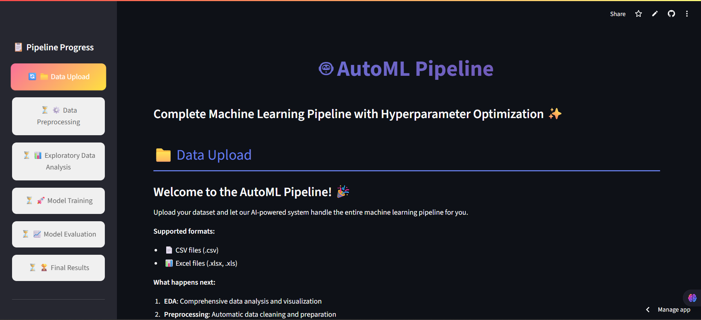

# 🚀 AutoML Pipeline

An end-to-end automated machine learning (AutoML) pipeline designed to take you from raw data to deployable insights with minimal manual effort — all while maintaining full control and transparency.

---

## 🖼️ UI Preview



---

## 📋 Workflow Overview

1. 📁 **Data Upload**  
   Upload your dataset and preview its structure.

2. ⚙️ **Data Preprocessing**  
   Clean and prepare your data for analysis and modeling.

3. 📊 **Exploratory Data Analysis (EDA)**  
   Dive into clean data with powerful visualizations and statistical insights.

4. 🚀 **Model Training**  
   Train multiple models efficiently using the prepared dataset.

5. 📈 **Model Evaluation**  
   Compare performance metrics and select the best model.

6. 🏆 **Final Results**  
   View summarized insights and results, ready for deployment or reporting.

---

## 🎨 Enhanced EDA with New Visualizations

### ✅ New Plot Types:
- 📊 **Pie Charts** – Understand class distribution in categorical features and targets.
- 📦 **Box Plots** – Detect outliers and study distributions.
- 📈 **Line Plots** – Analyze trends over time or index.
- 🎯 **KDE Plots** – Estimate and visualize continuous data distributions.

### ✅ Advanced EDA Features:
- **Interactive Plot Selection** – Choose your preferred visualization type.
- **Multiple Column Analysis** – Select and analyze specific features.
- **Target vs Feature Relationships**:
  - Box plots for classification problems
  - Scatter plots with trendlines for regression

---

## 🧪 Data Quality Assessment

- **Completeness Metrics** – Assess missing data patterns.
- **Target Quality Analysis** – Identify class imbalance or anomalies.
- **Feature Relationship Evaluation** – Understand dependencies and correlations.

---

## 📈 Enhanced Analysis Sections

- 🔍 **Target Variable Deep Dive** – Pie charts + descriptive stats
- 🧩 **Categorical Feature Analysis** – Pie & bar chart visualizations
- 🧠 **Feature Correlation Matrix** – Heatmaps + top correlated variables
- 🚦 **Data Quality Dashboard** – Traffic light system indicating health

---

## 💡 Better User Experience

- 🔄 **Progressive Workflow** – EDA uses clean, preprocessed data
- 🧼 **Clean Data First** – Ensures accurate, meaningful analysis
- 📊 **Visual Variety** – Rich chart types for all data types
- ✅ **Quality Indicators** – Color-coded for easy interpretation

---

## 🔧 Technologies Used

- Python (Pandas, NumPy, Scikit-learn)
- Plotly / Seaborn / Matplotlib for interactive and static visuals
- Streamlit or Dash (optional) for UI
- Jupyter for notebooks-based workflows

---

## 🧭 Why This Workflow?

> Clean → Analyze → Model → Evaluate → Results

This structure ensures high-quality insights and reliable models by focusing on clean data and transparent analysis before training.

---

## 📂 Project Structure (Example)

```
AutoML-Pipeline/
│
├── venv/ # Raw and cleaned datasets
├── app.py # Jupyter notebooks for EDA, modeling
├── README.md
└── requirements.txt
```

## 🏁 Getting Started

```bash
# Clone the repository
git clone https://github.com/longway2go-ai/AutoML-Pipeline.git
cd AutoML-Pipeline

# (Optional) Create a virtual environment
python -m venv venv
source venv/bin/activate  # or venv\Scripts\activate on Windows

# Install dependencies
pip install -r requirements.txt
```
## 🤝 Contributing
- Contributions are welcome! Please open an issue or submit a pull request.

## 📄 License
MIT License. See LICENSE file for details.
